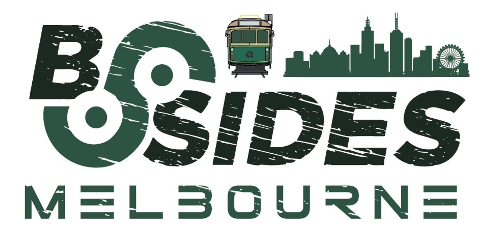
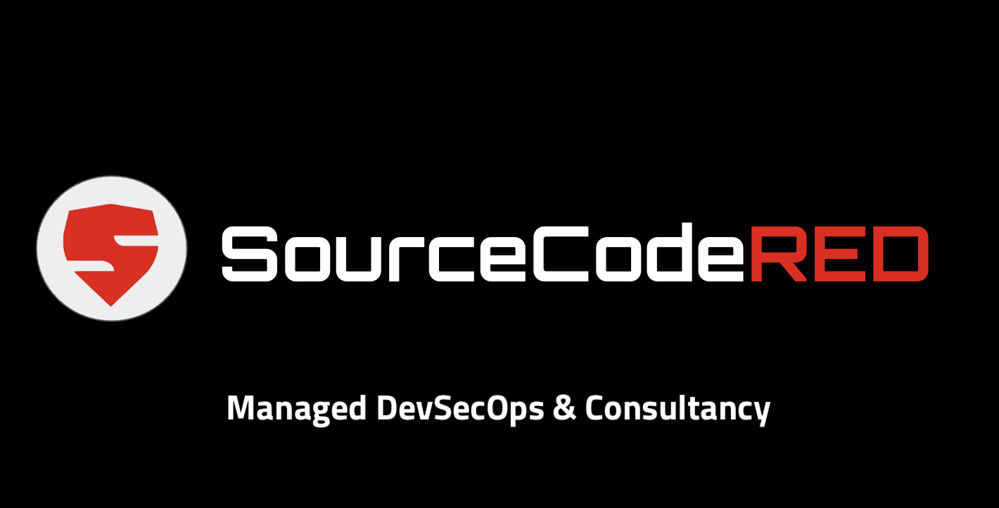

# Untitled

## Welcome to the Melbourne BSides SourceCodeRED CTF!

We love building CTFs and this years is better than ever!  We hope you enjoy it as much as we’ve enjoyed building and designing it!

This CTF is meant to simulate the techniques we will go over in the SourceCodeRED training session “Attacking and Defending the Software Supply Chain”.  

### Here are the details and rules:

1. SourceCodeRED CTF page is live at [https://ctf.sourcecodered.com](https://ctf.sourcecodered.com).  This CTF is open to anyone registered in the training session.
2. There are multiple flags you are looking for and each one comes with a certain number of points depending on difficulty.  Easy flag will be 1 point and more difficult questions will be worth more.
3. 

## How to play

The CTF starts here, at this page.  Find a clue and start earning points!   Once you have found your first clue you can start earning points by logging them here: [https://forms.gle/1zG7zPVKykrRWySy6](https://forms.gle/7TXFGeMHSs6vkdM9A)

This CTF is all about cloud native web application security.  You can be successful using only standard OSINT CLI tools like:  curl, dig, nmap, amass and a browser.  But if you want to make things a bit easier you can create a free SecureStack account at [https://app.securestack.com](https://app.securestack.com)

If you have any questions, or are stumped and need a clue, feel free to reach out to us at info@securestack.com.

### Brought to you by:

